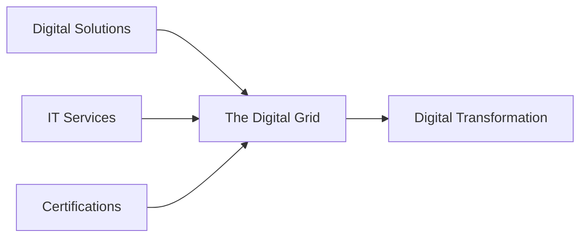
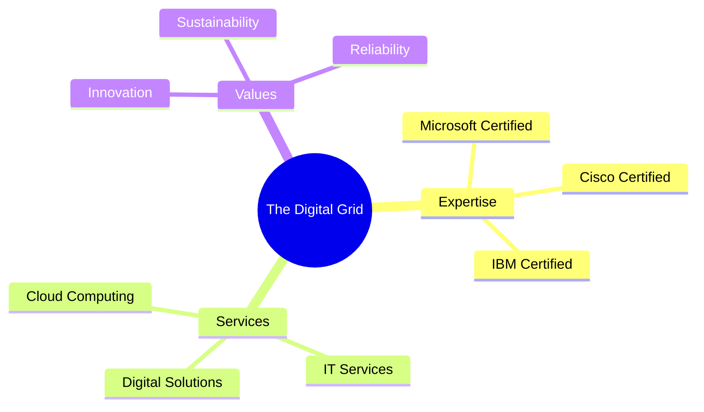

# The Digital Grid

_transparent.svg)

*Your Partner in Digital Transformation* 🚀

## 🌟 About Us

The Digital Grid is a forward-thinking technology company dedicated to providing sustainable IT solutions for modern businesses. We combine innovation with expertise to help organizations navigate their digital journey successfully.

## 🎯 Our Services

| Digital Solutions 💻 | IT Services 🌐 | Certifications 🎓 |
|-------------------|--------------|----------------|
| Digital Branding | IT Cloud Solutions | Microsoft |
| Digital Advertising | Buy-backs & E-waste | Cisco |
| Hardware & Software Sales | Professional IT Support | IBM |

## 💫 Why Choose Us?

## 📞 Contact Us

| Channel | Details |
|---------|---------|
| 📱 Phone | [074 264 5578](tel:0742645578) |
| 🌐 Website | [www.thedigitalgrid.co.za](https://www.thedigitalgrid.co.za) |
| 📧 Email | [th3digitalgrid@outlook.co.za](mailto:th3digitalgrid@outlook.co.za) |

## 🔗 Connect With Us

---

### 🌱 Sustainable IT Solutions for Modern Business

© 2024 The Digital Grid. All rights reserved.

